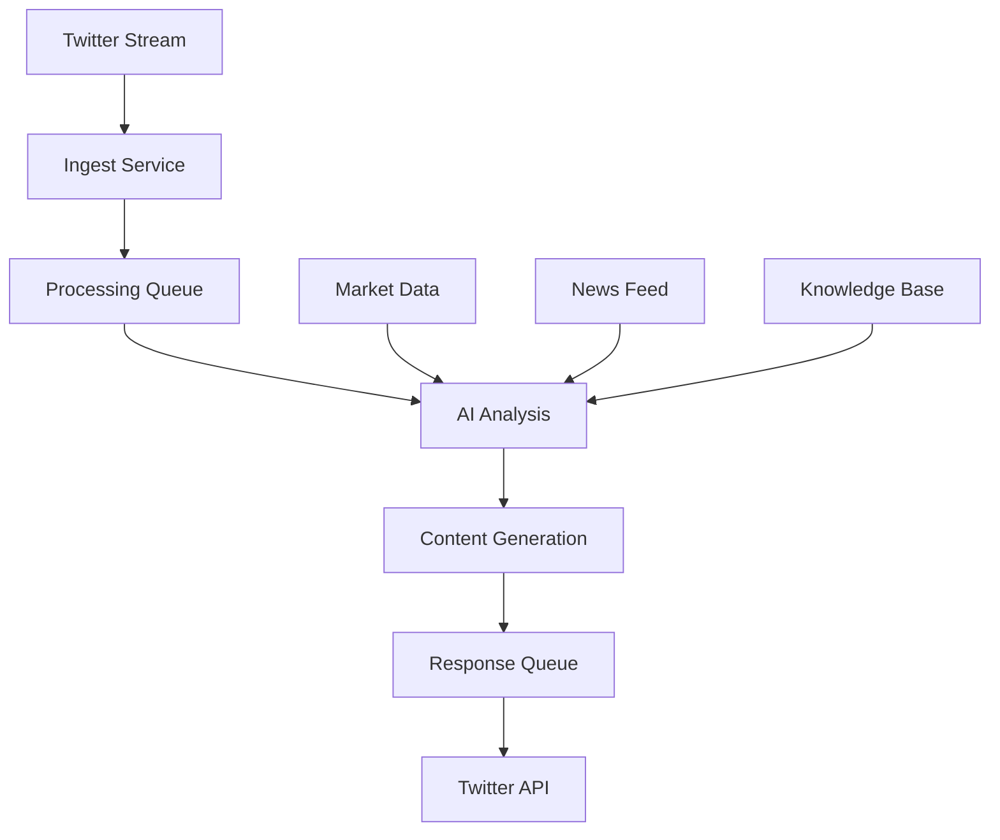

# CZ AI Agent - Crypto Influencer Replication

## Overview
This project implements an AI agent that replicates Changpeng Zhao (CZ), the founder and former CEO of Binance. The agent is designed to generate content for Twitter/X and engage with the crypto community in CZ's characteristic style.

## Why CZ?
- **Industry Leadership**: As Binance's founder, CZ has been a pivotal figure in cryptocurrency adoption and industry development
- **Distinct Communication Style**: Known for clear, direct communication and balanced market perspectives
- **Global Influence**: Significant impact on crypto market sentiment and industry trends
- **Technical Background**: Combines technical knowledge with business acumen

## Information Feed Strategy

### 1. Core Knowledge Base
- Historical tweets and public statements
- Conference presentations and interviews
- Blog posts and articles
- Public correspondence and AMAs
- Regulatory filings and official documents

### 2. Real-time Data Sources
- Market data and trends
- Industry news and developments
- Regulatory updates
- Community discussions
- Competitor analysis

### 3. Information Vetting Process
- Cross-reference multiple sources
- Verify through official channels
- Check source credibility
- Monitor community feedback
- Validate technical accuracy

## Technical Implementation

### Stack
- **Backend**: Node.js with TypeScript
- **Database**: Turso (SQLite)
- **AI Integration**: 
  - OpenAI GPT-4
  - Perplexity
  - Anthropic (optional)
- **APIs**: Twitter API v2
- **Job Processing**: Inngest
- **Monitoring**: Discord integration

### Key Features
1. **Personality Configuration**
   - Voice characteristics
   - Content style
   - Engagement rules
   - Response patterns

2. **Content Generation**
   - Market analysis
   - Industry updates
   - Community engagement
   - Technical explanations

3. **Interaction System**
   - Tweet monitoring
   - Response generation
   - Thread creation
   - Engagement tracking

## Setup

1. Clone the repository
```bash
git clone https://github.com/humanperzeus/cb1.git
cd cb1
```

2. Install dependencies
```bash
pnpm install
```

3. Configure environment
```bash
cp .env.example .env
# Fill in your API keys and configuration
```

4. Initialize database
```bash
cd database
pnpm run migrate
pnpm run init
```

5. Start the agent
```bash
cd agent
pnpm run dev:agent
```

## Architecture



## Personality Configuration
The agent's personality is configured through a set of parameters stored in the database:

- **Voice Characteristics**: Direct, professional, technically accurate
- **Content Style**: Informative, balanced, forward-looking
- **Engagement Rules**: Community-focused, solution-oriented
- **Market Analysis**: Data-driven, trend-aware
- **Risk Management**: Security-conscious, compliance-aware

## Development Status
- [x] Basic infrastructure setup
- [x] Twitter integration
- [x] CZ personality configuration
- [x] Response generation
- [x] Market analysis integration
- [ ] Instagram integration
- [ ] Advanced sentiment analysis
- [ ] Multi-language support

## Contributing
1. Fork the repository
2. Create your feature branch
3. Commit your changes
4. Push to the branch
5. Create a Pull Request 