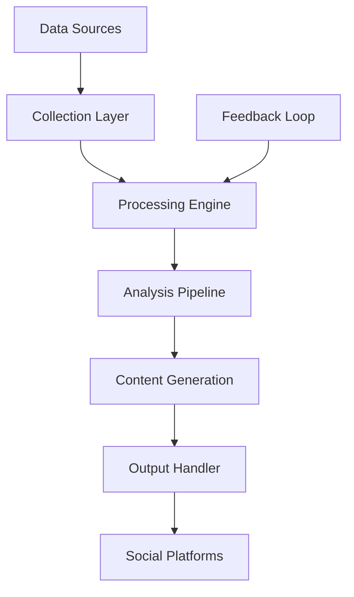

# CZ AI Agent - Architecture and Implementation Plan

## Overview
This repository outlines the architecture and implementation plan for an AI agent that would replicate CZ's (Changpeng Zhao) social media presence. This is a comprehensive plan detailing how to build a system that would generate authentic, informed content in CZ's style.

## Why CZ?
- **Technical Expertise**: Deep understanding of blockchain technology and crypto markets
- **Communication Style**: Clear, professional, and impactful messaging
- **Market Influence**: Significant thought leadership in the crypto space
- **Global Perspective**: International outlook on crypto adoption and regulation

## Information Feed Strategy

### 1. Historical Data Collection
- Twitter archive analysis
- Conference presentations
- Interviews and AMAs
- Blog posts and articles
- Official statements

### 2. Real-time Data Sources
- Market data feeds
- Regulatory updates
- Industry news
- Community sentiment
- Technical metrics

### 3. Information Vetting Process
- Source verification protocol
- Cross-reference system
- Contextual validation
- Accuracy checks
- Feedback integration

## Proposed Technical Architecture

### Data Layer
- Content collection APIs
- Market data integrations
- News feed processors
- Storage systems

### Processing Layer
- Content analysis engine
- Pattern recognition system
- Sentiment analyzer
- Response generator

### Output Layer
- Platform-specific formatters
- Scheduling system
- Engagement tracker
- Analytics engine

## System Flow

## Implementation Phases

### Phase 1: Foundation
- Data collection system
- Basic AI training
- Platform integration

### Phase 2: Enhancement
- Advanced analysis
- Multi-platform support
- Real-time adaptation

### Phase 3: Optimization
- Performance tuning
- Advanced features
- Scale handling

## Quality Control
- Fact-checking system
- Tone verification
- Context validation
- Community feedback loop

## Development Approach
This plan emphasizes:
- Data-driven decision making
- Scalable architecture
- Quality control
- Ethical considerations
- Community engagement

## Note
This repository contains the architectural plans and implementation strategy for the CZ AI Agent. It serves as a blueprint for development, highlighting key components and considerations for building an effective AI-driven social media presence. 