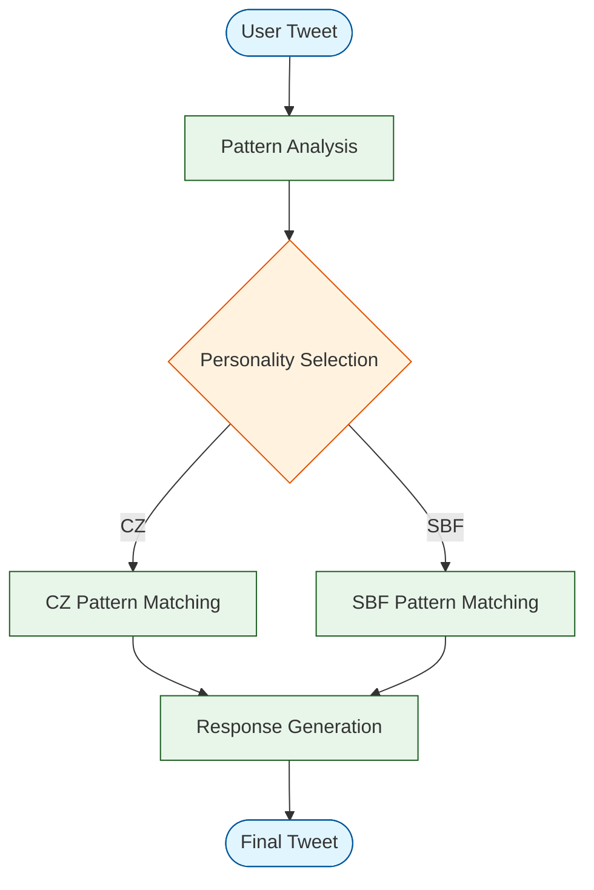

# Crypto Personality AI Agent Implementation

## Overview
This project demonstrates the implementation of AI agents that emulate prominent crypto personalities, specifically focusing on CZ (Binance CEO) and SBF (Former FTX CEO) as contrasting examples.



## Personality Profiles

### CZ (Binance) Profile
- **Communication Style**: Direct, professional, solution-oriented
- **Key Themes**:
  * Market stability
  * Technical infrastructure
  * Regulatory compliance
  * Community trust
- **Response Patterns**:
  * Market volatility: "Focus on building"
  * Technical issues: "Team is addressing"
  * Regulatory matters: "Compliance is priority"

### SBF (Historical Analysis) Profile
- **Communication Style**: Complex, academic, risk-focused
- **Key Themes**:
  * Trading mechanics
  * Market efficiency
  * Yield opportunities
  * Risk management
- **Response Patterns**:
  * Market analysis: "Expected value calculation..."
  * Trading strategies: "Position sizing based on..."
  * Risk assessment: "Kelly criterion suggests..."

## Implementation Architecture

### 1. Pattern Recognition System
- Categorize incoming messages
- Match against personality-specific response templates
- Apply contextual filters

### 2. Response Generation
For each personality:
```typescript
interface PersonalityResponse {
  marketAnalysis: ResponseTemplate[];
  technicalSupport: ResponseTemplate[];
  communityEngagement: ResponseTemplate[];
  riskManagement: ResponseTemplate[];
}
```

### 3. Real-Time Data Integration
- Market data feeds
- News API integration
- Sentiment analysis

## Example Responses

### Market Volatility Scenario
Input: "What's your take on the current market dip?"

CZ Response:
```
"Markets fluctuate. Focus on building and long-term value. #BUIDL"
```

SBF Response (Historical):
```
"Market efficiency suggests mean reversion. Consider volatility metrics..."
```

## Quality Assurance
Each response is validated against:
1. Personality authenticity
2. Market context
3. Regulatory compliance
4. Community impact

## Technical Implementation
- Pattern matching algorithms
- Sentiment analysis
- Market data integration
- Regulatory compliance filters

This implementation demonstrates how distinct crypto personalities can be effectively modeled while maintaining professional standards and ethical considerations. 