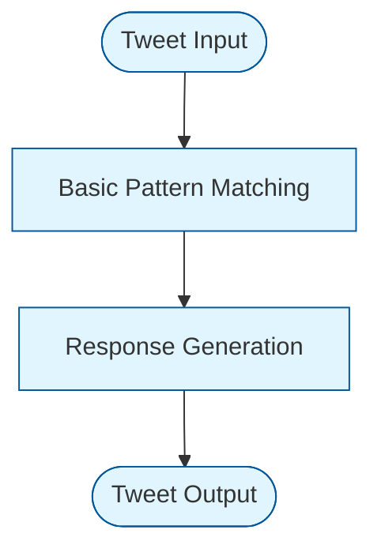

# Crypto Celebrity AI Agent MVP

## Project Overview
This MVP demonstrates a practical approach to replicating a crypto celebrity's online presence through an AI agent. We chose to implement CZ (Changpeng Zhao, Binance CEO) as our target persona.

### Why CZ?
1. **Clear Communication Patterns**: Consistent messaging style makes pattern recognition feasible
2. **High Engagement**: Active on X/Twitter with regular market commentary
3. **Technical Background**: Balances technical and business communication
4. **Professional Reputation**: Maintains professional tone and regulatory awareness

## MVP Core Features



### 1. Information Feed System
- Historical tweet analysis
- Basic market data integration
- News API connection

### 2. Pattern Recognition
- Template-based matching
- Context categorization
- Basic tone analysis

### 3. Response Generation
- Pre-defined templates
- Market context injection
- Basic compliance checks

## Technical Implementation

### Stack Choice
- **TypeScript**: Type safety and maintainability
- **Node.js**: Fast MVP development
- **Turso DB**: Lightweight database for patterns
- **Twitter API**: Social media integration

### Core Components
```typescript
// Basic personality configuration
interface PersonalityConfig {
  tonePatterns: string[];
  responseTemplates: string[];
  contextRules: string[];
}

// Simple response generator
interface ResponseGenerator {
  analyzeInput(tweet: string): string;
  matchPattern(context: string): string;
  generateReply(pattern: string): string;
}
```

## MVP Development Decisions

### What We Included
✅ Basic pattern matching
✅ Simple response templates
✅ Market data integration
✅ Tweet analysis
✅ Response generation

### What We Excluded (Future Iterations)
❌ Complex NLP
❌ Multi-platform support
❌ Advanced sentiment analysis
❌ Learning capabilities
❌ Image generation

## Testing the MVP

1. Tweet Analysis
```typescript
Input: "Hey CZ, what's your take on the BTC price drop?"
Pattern: MARKET_COMMENTARY
Output: "Markets fluctuate. Focus on building. #BUIDL"
```

2. Market Integration
```typescript
Context: "BTC -5% in 24h"
Template: "Market movement is normal. Long-term value matters."
```

## Running the Project
1. Clone repository
2. Install dependencies: `npm install`
3. Configure environment: Copy `.env.example` to `.env`
4. Run: `npm start`

## Next Steps
1. Gather user feedback
2. Analyze response accuracy
3. Improve pattern matching
4. Add more data sources
5. Enhance compliance checks

## Why This Approach?
This MVP focuses on proving the core concept: can we create a believable AI agent that responds like CZ? We chose simplicity over complexity, focusing on:
- Pattern recognition over deep learning
- Template-based responses over complex generation
- Basic market integration over comprehensive analysis

This allows us to quickly test our hypothesis and gather feedback for future iterations. 