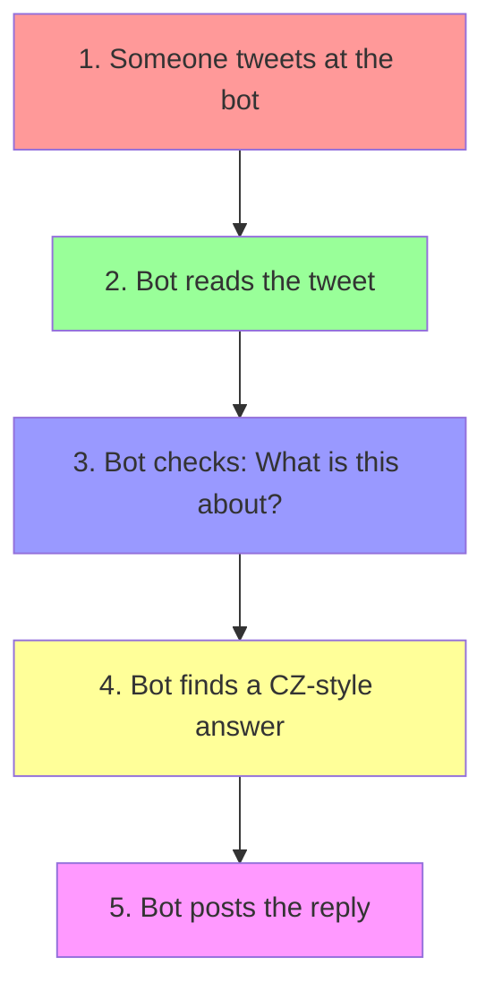

# How to Make a CZ Twitter Bot 🤖

## What Are We Building?
A Twitter bot that talks like CZ (the Binance guy) by copying how he responds to people. Think of it like a smart parrot that learned CZ's way of talking.

## How Does It Work? 🤔

## The Secret Sauce 🔍

### 1. Learning CZ's Style
- Save all of CZ's tweets
- Group them by topics:
  * Market talk ("Bitcoin is going up/down")
  * Tech talk ("Blockchain is secure")
  * Community stuff ("Thanks for support")
  * Problem solving ("We're fixing it")

### 2. Making Response Templates
Example of how the bot thinks:

IF someone asks about "Bitcoin price" 👉 Use CZ's typical market responses:
- "Focus on building"
- "DYOR (Do Your Own Research)"
- "Long-term thinking is important"

IF someone reports a problem 👉 Use CZ's typical help responses:
- "Team is on it"
- "Thanks for reporting"
- "Will check and update"

### 3. Adding Real-Time Smarts 📈
- Check current market prices
- Look at latest crypto news
- See if people are happy or sad about something

## How We Build It 🛠️

### Step 1: Collect CZ's Greatest Hits
- Save his best tweets
- Note how he handles different situations
- Create a "CZ response cookbook"

### Step 2: Make It Smart
- Connect to crypto price feeds
- Hook up to news websites
- Watch what's trending

### Step 3: Test and Improve
- Start with simple replies
- Check if it sounds like CZ
- Fix any weird responses

## Quality Check ✅
Before each tweet, the bot asks itself:
1. "Would CZ say this?"
2. "Is this helpful?"
3. "Is this the right time to say it?"

## Simple Example

Someone tweets: "Hey @CZBot, what do you think about Bitcoin's price drop?"

Bot thinks:
1. This is about market prices 📉
2. Checks: Market is down
3. Finds matching CZ-style response
4. Replies: "Focus on building. Market cycles come and go. 💪"

## That's It!
- Bot reads tweets
- Matches them to CZ's style
- Gives helpful responses
- Stays professional like CZ

No fancy AI magic - just smart pattern matching and CZ's wisdom! 🎯 