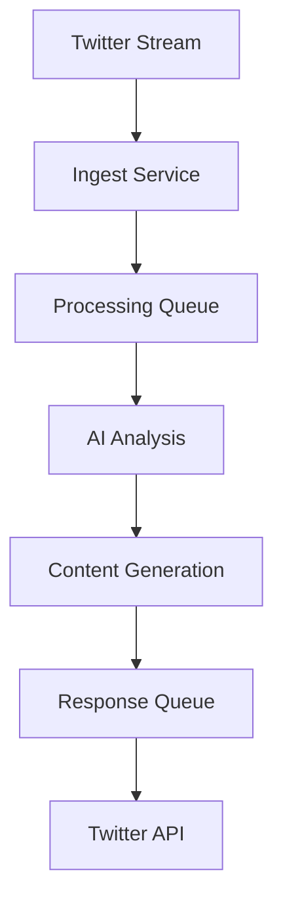

# CZ AI Agent - 1-Hour MVP Implementation

## Overview
This project demonstrates a proof-of-concept AI agent that replicates CZ's (Changpeng Zhao) personality for Twitter interactions. Built as a 1-hour technical challenge, it showcases the basic architecture and implementation approach.

## Why CZ?
- **Industry Leadership**: As Binance's founder, CZ has been a pivotal figure in cryptocurrency adoption
- **Distinct Communication Style**: Known for clear, direct communication
- **Technical Background**: Combines technical knowledge with business acumen

## Implemented Features

### Core System
- Basic Twitter interaction setup
- CZ personality configuration
- Response generation framework
- Database schema design

### Technical Stack
- **Backend**: Node.js with TypeScript
- **Database**: Turso (SQLite)
- **AI**: OpenAI GPT-4, Perplexity
- **API**: Twitter API v2

## Setup

1. Clone the repository
```bash
git clone https://github.com/humanperzeus/cb1.git
cd cb1
```

2. Install dependencies
```bash
pnpm install
```

3. Configure environment
```bash
cp .env.example .env
# Fill in your API keys and configuration
```

4. Initialize database
```bash
cd database
pnpm run migrate
pnpm run init
```

5. Start the agent
```bash
cd agent
pnpm run dev:agent
```

## Architecture



## Personality Configuration
Basic personality parameters implemented:
- Voice characteristics
- Content style
- Engagement rules

## Note
This is a 1-hour technical challenge implementation. It demonstrates the architectural approach and basic functionality while highlighting potential for future expansion.

## Contributing
1. Fork the repository
2. Create your feature branch
3. Commit your changes
4. Push to the branch
5. Create a Pull Request 