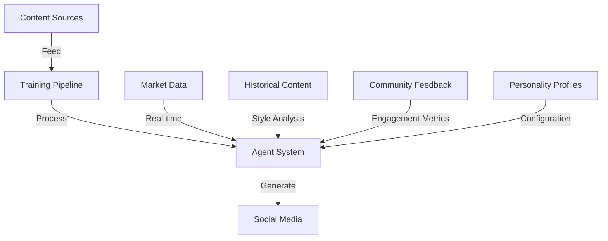

# Celebrity AI Agent: Crypto Personality Replication 🤖

## Overview

This project is an intelligent AI agent system that replicates the personalities and expertise of prominent crypto industry figures. Currently implemented personalities include:

1. CZ (Changpeng Zhao) - Founder and CEO of Binance
   - Technical and security-focused
   - Professional and measured communication
   - Global industry perspective
   - Regulatory awareness

2. Ran Neuner (Crypto Banter)
   - Energetic and enthusiastic delivery
   - Educational yet entertaining
   - Market-focused analysis
   - Strong community engagement

## Tech Stack

### Core Technologies
- **Language**: TypeScript
- **Runtime**: Node.js
- **Database**: Turso (SQLite with vector extensions)
- **ORM**: Drizzle
- **Vector Embeddings**: OpenAI text-embedding-3-small (1536 dimensions)
- **AI Models**: 
  - OpenAI GPT-4 (Content Generation)
  - Perplexity (Market Analysis)
  - Anthropic (Fact Checking)
  - DeepSeek (Technical Analysis)
  - XAI (Sentiment Analysis)

### Content Sources
1. **Historical Content**
   - YouTube Live Streams
   - Twitter Posts
   - Community Engagement
   - Educational Content

2. **Market Data**
   - Price Feeds
   - Trading Volumes
   - Market Sentiment
   - On-chain Metrics

3. **News & Analysis**
   - Breaking News
   - Technical Analysis
   - Project Updates
   - Regulatory News

### Personality Training
- Voice and Style Analysis
- Common Phrases
- Engagement Patterns
- Content Structure
- Humor and Tone

## Database Schema

### Core Tables
1. **Content**: Stores historical content
   - Source (Twitter, interviews, articles)
   - Type (Analysis, News, Education)
   - Engagement metrics
   - Sentiment analysis

2. **ContentVector**: Vector embeddings for content
   - Style vectors
   - Topic vectors
   - Sentiment vectors

3. **MarketData**: Real-time market information
   - Price data
   - Volume data
   - Sentiment indicators
   - Technical indicators

4. **PersonalityConfig**: Agent personality settings
   - Voice characteristics per personality
   - Response templates
   - Engagement rules
   - Content preferences
   - Personality-specific traits

## Key Features

### 1. Content Analysis
- Historical content vectorization
- Style pattern recognition per personality
- Engagement pattern analysis
- Topic expertise mapping

### 2. Content Generation
- Twitter threads and replies
- Market analysis
- Industry commentary
- Educational content

### 3. Personality Replication
- Distinct voice per personality
- Consistent communication style
- Role-appropriate engagement
- Community interaction patterns

### 4. Quality Control
- Fact checking
- Market data verification
- Role-appropriate responses
- Community feedback

## Content Pipeline

### 1. Data Collection
\`\`\`typescript
interface ContentSource {
  type: 'youtube' | 'twitter' | 'blog';
  url: string;
  metadata: {
    date: Date;
    engagement: EngagementMetrics;
    topics: string[];
  };
}
\`\`\`

### 2. Content Processing
\`\`\`typescript
interface ContentAnalysis {
  style: StyleVector;
  topics: TopicVector[];
  sentiment: SentimentScore;
  keyPhrases: string[];
}
\`\`\`

### 3. Generation Rules
\`\`\`typescript
interface ContentRules {
  maxThreadLength: number;
  topicFrequency: Map<string, number>;
  styleGuides: StyleGuide[];
  engagementPatterns: Pattern[];
}
\`\`\`

## Personality Training

### Style Analysis
- Individual voice patterns
- Characteristic phrases
- Media usage patterns
- Engagement timing
- Role-specific responses

### Topic Expertise
- Area of focus per personality
- Communication approach
- Content structure
- Engagement patterns

## Development

### Prerequisites
Same as before, plus:
\`\`\`bash
# Content processing tools
yt-dlp # YouTube content
twint # Twitter archiving
\`\`\`

### Content Collection
1. Historical content:
   \`\`\`bash
   pnpm run collect:youtube
   pnpm run collect:twitter
   pnpm run analyze:content
   \`\`\`

2. Training:
   \`\`\`bash
   pnpm run train:style
   pnpm run train:topics
   \`\`\`

## Testing

### Content Generation
- \`content:tweet\`: Generate tweets
- \`content:thread\`: Create thread
- \`content:analysis\`: Market analysis
- \`content:engage\`: Community engagement

## Design Decisions

### Why This Approach?
1. Vector embeddings capture:
   - Writing style
   - Topic expertise
   - Engagement patterns
   - Content structure

2. Multi-model pipeline:
   - GPT-4: Core content
   - Perplexity: Market analysis
   - Anthropic: Fact checking
   - DeepSeek: Technical patterns

### Quality Control
1. Fact verification
2. Market data validation
3. Community feedback
4. Engagement metrics

## Security & Ethics

1. Content Disclosure
   - Clear AI agent identification
   - Role-appropriate disclaimers
   - Scope of expertise warnings

2. Data Protection
   - API security
   - Content source tracking
   - User data protection
   - Personality rights management

## Monitoring

1. Content Performance
2. Engagement Metrics
3. Accuracy Tracking
4. Community Feedback

## Future Improvements

1. Voice Clone Integration
2. Live Stream Capabilities
3. Real-time Market Analysis
4. Community Interaction Enhancement

## Contact

[Your Contact Information] 