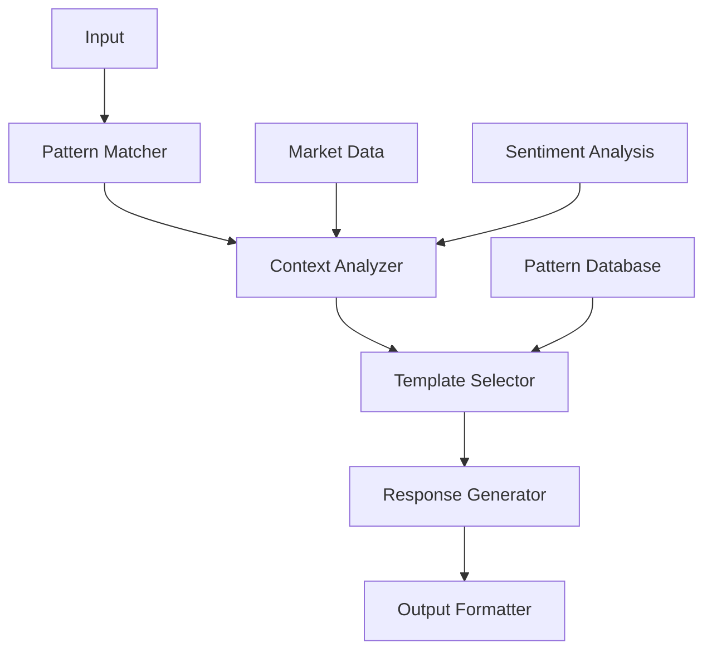

# CZ AI Agent - Eliza-Inspired Architecture Plan

## Overview
This repository outlines an Eliza-inspired architecture for a CZ (Changpeng Zhao) AI agent. By leveraging Eliza's proven pattern-matching and response template system, combined with modern NLP and crypto-specific knowledge, we can create an effective social media presence that mirrors CZ's communication style.

## Why Eliza Framework?
- **Proven Methodology**: Eliza's pattern-matching system has been effective since the 1960s
- **Template-Based Responses**: Allows for consistent, personality-driven communication
- **Scalable Architecture**: Easy to expand with new patterns and responses
- **Natural Conversation Flow**: Built-in context management

## Why CZ?
- **Pattern-Rich Communication**: CZ's consistent communication style fits well with Eliza's approach
- **Technical Expertise**: Clear technical patterns in responses about blockchain and crypto
- **Structured Messaging**: Regular patterns in market commentary and updates
- **Predictable Engagement**: Consistent interaction patterns with community

## Pattern Recognition System

### 1. Core Pattern Categories
- Market Commentary Templates
- Technical Explanations
- Regulatory Responses
- Community Engagement
- Crisis Management

### 2. Response Framework
```typescript
interface ResponseTemplate {
  pattern: RegExp;
  context: 'market' | 'technical' | 'regulatory' | 'community';
  responses: string[];
  conditions: {
    marketCondition?: 'bull' | 'bear' | 'neutral';
    sentiment?: 'positive' | 'negative' | 'neutral';
    confidence?: number;
  };
}
```

### 3. Pattern Examples
```typescript
const patterns = {
  marketUpdate: {
    pattern: /(bitcoin|btc|market) (price|prediction|outlook)/i,
    responses: [
      "Focus on building. Market cycles come and go.",
      "DYOR. Long-term value comes from utility.",
      "Fundamentals matter more than short-term price action."
    ]
  },
  technical: {
    pattern: /(blockchain|crypto|web3) (development|technology)/i,
    responses: [
      "Security first. Always.",
      "Building robust infrastructure is key.",
      "Decentralization requires careful balance."
    ]
  }
};
```

## System Architecture



## Implementation Strategy

### Phase 1: Pattern Collection
- Analyze CZ's historical responses
- Identify common patterns
- Create response templates
- Build pattern database

### Phase 2: Context Integration
- Market data integration
- Sentiment analysis
- News feed processing
- Pattern validation

### Phase 3: Response Generation
- Template customization
- Context-aware responses
- Personality alignment
- Quality control

## Quality Assurance
- Pattern accuracy verification
- Response appropriateness
- Context validation
- Community feedback integration

## Development Approach
- Start with core patterns
- Iteratively add complexity
- Continuous pattern refinement
- Regular template updates

## Note
This implementation leverages the proven Eliza framework's pattern-matching system, enhanced with modern NLP and crypto-specific knowledge. The system maintains CZ's communication style while ensuring accurate and contextually appropriate responses. 