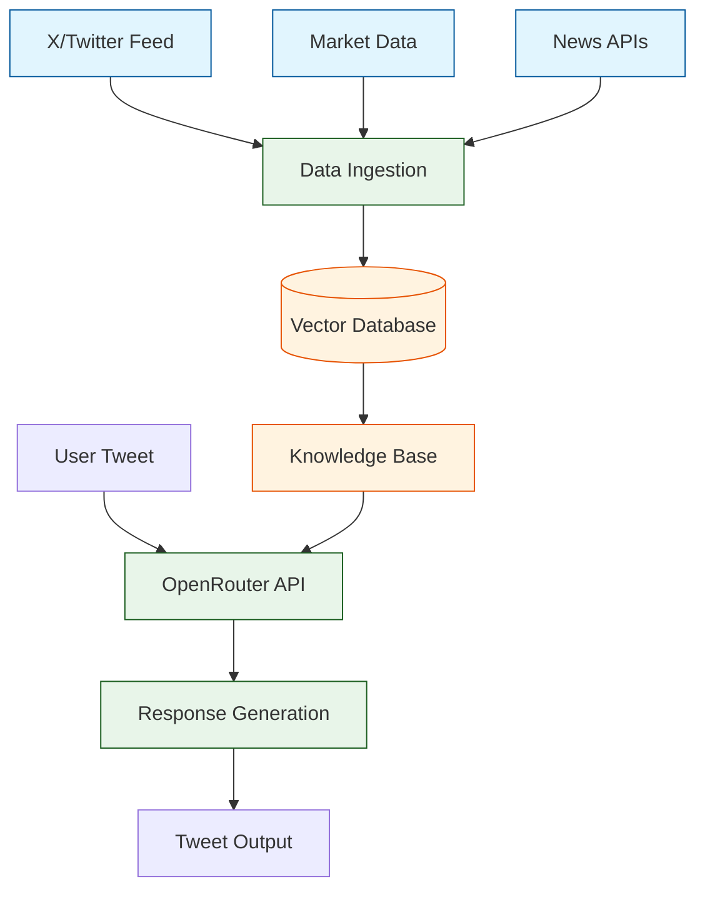

# CZ AI Agent - Modern AI Architecture MVP

## High-Level Approach
This MVP demonstrates a scalable approach to creating an AI agent that authentically replicates CZ's online presence using modern AI infrastructure and real-time data enrichment.

### Why CZ?
- Consistent online presence (X/Twitter)
- Clear communication patterns
- High engagement in crypto markets
- Strong technical and business insights
- Real-time market commentary

## Architecture Overview



## Core Components

### 1. Data Pipeline
- Real-time X/Twitter scraping
- Market data integration
- News API feeds
- Automatic data enrichment

### 2. Knowledge Management
- Vector database for semantic search
- Real-time data updates
- Context-aware retrieval
- Historical pattern analysis

### 3. AI Integration
- OpenRouter API for model selection
- Context-aware prompting
- Real-time response generation
- Tone and style matching

## Technical Stack

### Infrastructure
- **OpenRouter**: Flexible AI model access
- **Vector DB**: Efficient knowledge storage
- **TypeScript/Node.js**: Backend implementation
- **Twitter API**: Social media integration

### Key Features
```typescript
interface KnowledgeBase {
  vectorStore: VectorDatabase;
  realTimeData: MarketDataStream;
  historicalContext: TwitterArchive;
}

interface AIAgent {
  async generateResponse(
    input: Tweet,
    context: KnowledgeBase
  ): Promise<Response>;
}
```

## MVP Implementation

### Phase 1: Data Collection
✅ Twitter API integration
✅ Historical tweet analysis
✅ Market data streams
✅ News feed integration

### Phase 2: Knowledge Base
✅ Vector database setup
✅ Real-time indexing
✅ Context enrichment
✅ Pattern analysis

### Phase 3: AI Integration
✅ OpenRouter API setup
✅ Response generation
✅ Style matching
✅ Output validation

## Quick Start
```bash
# Install dependencies
npm install

# Configure environment
cp .env.example .env

# Set up your keys
OPENROUTER_API_KEY=your_key
TWITTER_API_KEY=your_key
VECTOR_DB_URL=your_url

# Run the agent
npm start
```

## Example Flow

```typescript
// 1. Incoming tweet
const tweet = "Hey CZ, thoughts on the market?"

// 2. Context gathering
const context = await knowledgeBase.getRelevantContext(tweet)
const marketData = await realTimeData.getMarketStatus()

// 3. AI response generation
const response = await openRouter.generate({
  context,
  marketData,
  styleGuide: CZ_PATTERNS
})

// 4. Output & store
await twitter.reply(tweet.id, response)
await vectorStore.store(response)
```

## Why This Architecture?

1. **Scalability**: Vector database allows efficient knowledge retrieval
2. **Real-time**: Continuous data enrichment keeps responses current
3. **Flexibility**: OpenRouter enables easy model switching
4. **Authenticity**: Rich context ensures CZ-like responses
5. **Maintainability**: Clear separation of concerns

## Next Steps
1. Enhance vector search accuracy
2. Implement multi-model comparison
3. Add sentiment analysis
4. Expand data sources
5. Implement A/B testing

## Development Roadmap
1. MVP: Basic response generation
2. V1: Enhanced context awareness
3. V2: Multi-platform support
4. V3: Advanced learning capabilities 